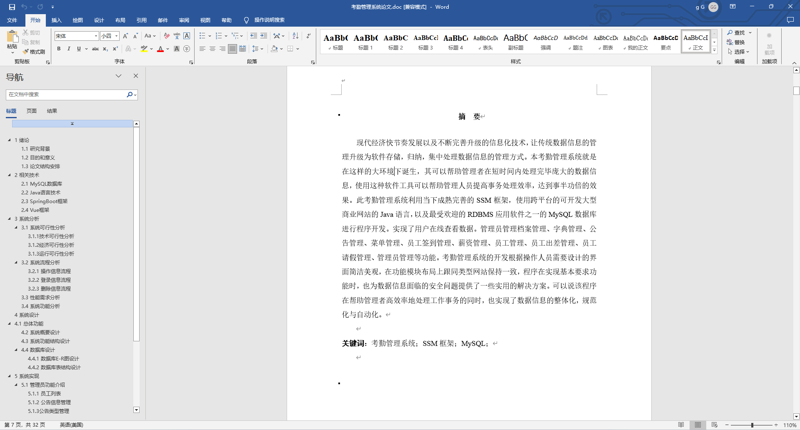
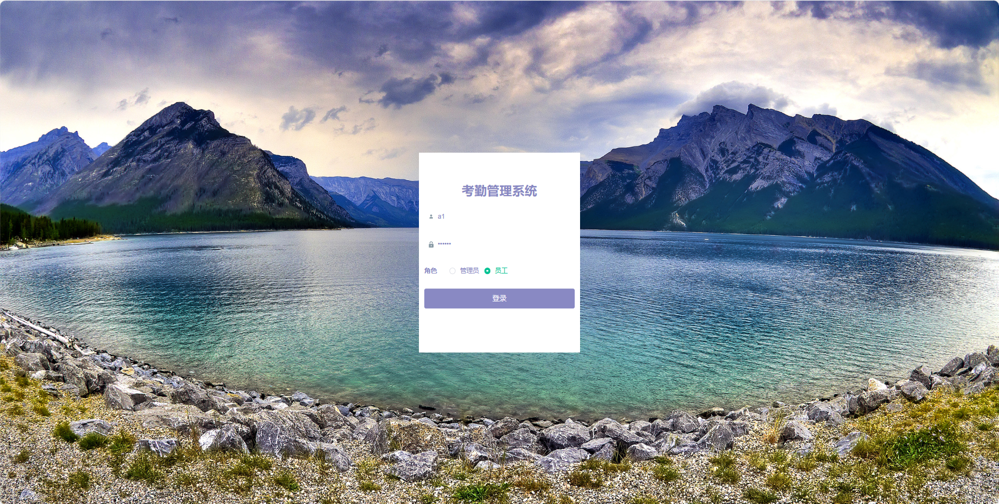
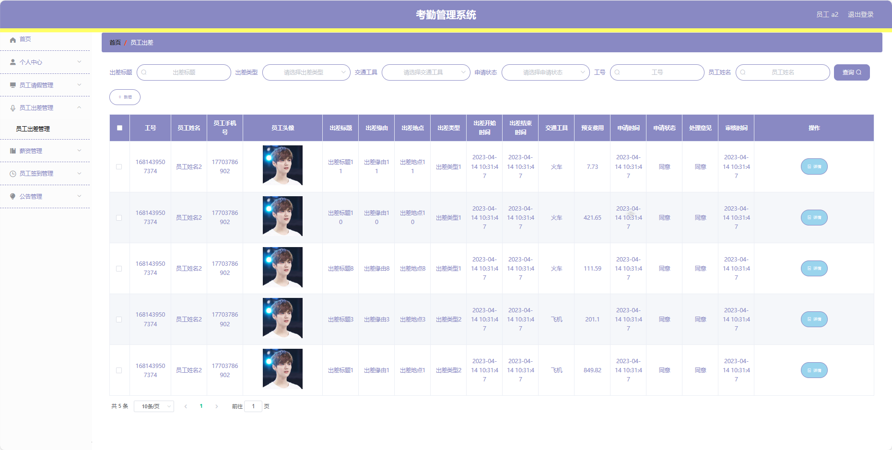
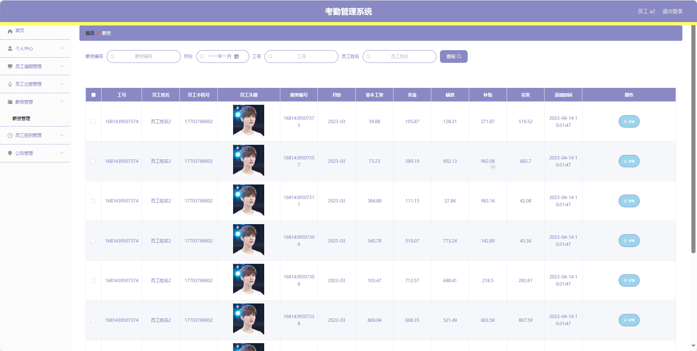
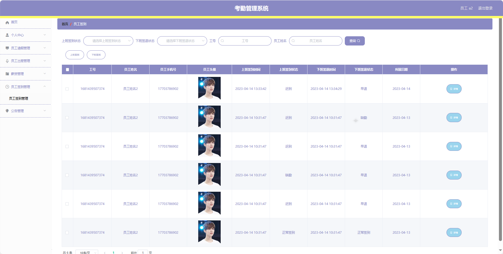
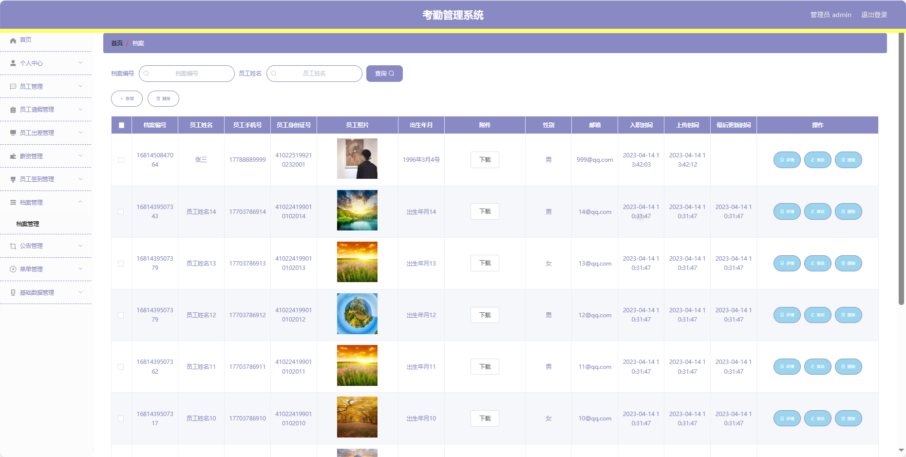
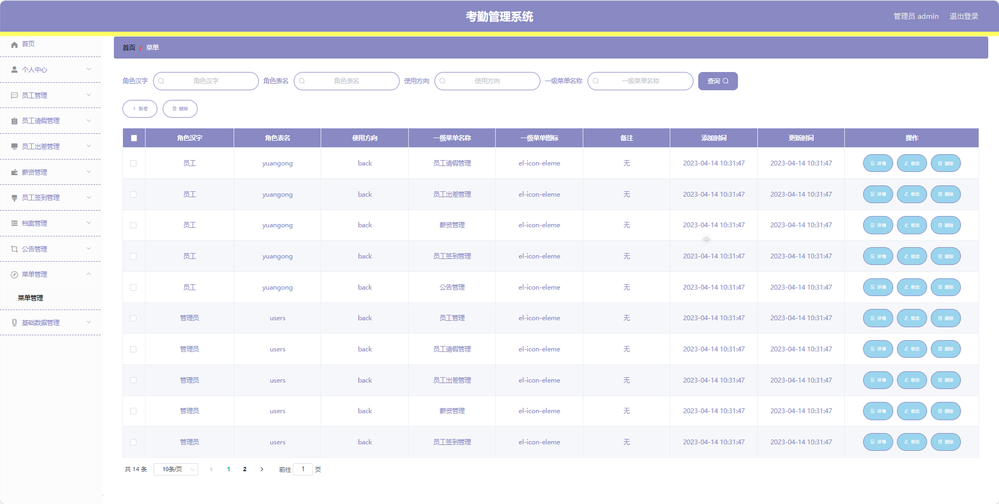
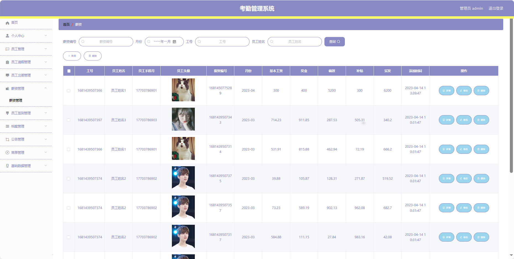
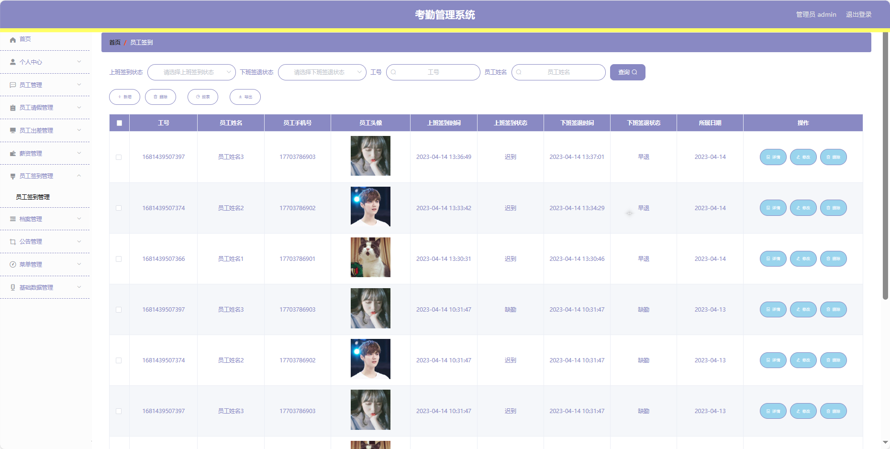
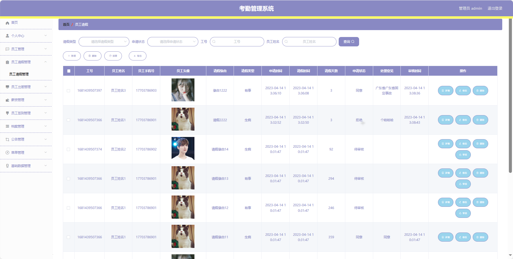

## 基于SpringBoot的考勤管理系统(程序+报告)

###  获取sql数据库文件: 从戎源码网 (https://armycodes.com/) QQ: 386869957 QQ群: 377586148
###  所有系统地址: (https://github.com/YuLin-Coder/AllProjectCatalog) 
###  所有项目以及源代码本人均调试运行无问题 可支持远程安装部署调试、定制修改、代码讲解

## 项目介绍
基于SpringBoot的考勤管理系统，系统包含两种角色：员工、管理员主要功能如下。

【员工功能】

1. **首页：** 显示员工个人信息。
2. **个人中心：**
   - **修改密码：** 修改员工账户的登录密码。
   - **个人信息：** 查看和编辑个人基本信息。
3. **员工请假管理：** 提交请假申请。
4. **员工出差管理：** 提交出差申请。
5. **薪资管理：** 查看个人薪资信息。
6. **员工签到管理：** 进行每日签到。
7. **公告管理：** 查看公司发布的通知公告。

【管理员功能】

1. **首页：** 显示系统的整体概。
2. **个人中心：**
   - **修改密码：** 修改管理员账户的登录密码。
   - **个人信息：** 查看和编辑管理员的基本信息。
3. **员工管理：** 管理公司的员工信息，。
4. **员工请假管理：** 查看员工请假申请。
5. **员工出差管理：** 查看员工出差申请。
6. **薪资管理：** 查看员工的薪资信息。
7. **员工签到管理：** 查看员工的签到记录。
8. **档案管理：** 管理员工的档案信息。
9. **公告管理：** 发布和管理通知公告，。
10. **菜单管理：** 管理系统的菜单。
11. **基础数据管理：**
    - **部门管理：** 维护公司部门的信息。
    - **公告类型管理：** 维护通知公告的分类。
    - **出差类型管理：** 管理出差申请的分类。
    - **交通工具管理：** 维护公司提供的交通工具信息。
    - **请假类型管理：** 管理请假申请的分类。
    
## 项目技术
- 编程语言：Java
- 数据库：MySQL
- 项目管理工具：Maven
- 前端技术：HTML、CSS、JavaScript、Jquery、Vue
- 后端技术：Spring、SpringMVC、MyBatis

## 运行环境
- JDK版本：JDK1.8及以上
- 开发工具：IDEA、Ecplise、Myecplise都可以
- 数据库: MySQL5.7及以上
- Maven：maven3.0及以上
- Node：14.14.0及以上

## 运行截图

